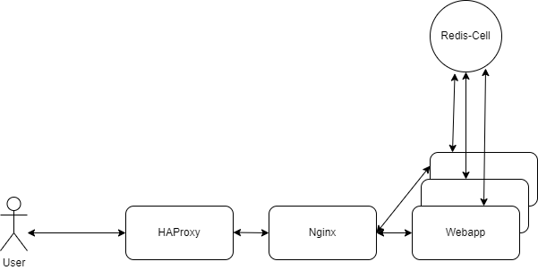

# Rate-Limit-System-Design

限流器的系统设计

## 架构图

## 设计思路
1. HAProxy之所以在nginx前面，是因为它需要对IP进行限流。nginx虽然也可以实现限流功能，但它毕竟是多进程模式，进程间无法共享一个ip的统计值如访问频率。
2. [Redis-Cell](https://github.com/brandur/redis-cell)也有限流的功能，但是如果将它放置在HAProxy的位置，它无法实现HAProxy的高性能。因此，redis-cell主要是在业务层面对写操作进行限流，比如24小时内只能上传10个视频，5分钟内只能发布3条博文。因此，由于写操作量不大webapp可以在过滤请求之时访问数据库，并把规则缓存到redis-cell中。
