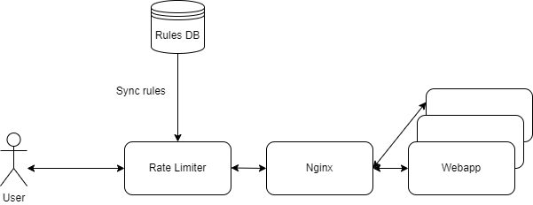

# Rate-Limit-System-Design

限流器的系统设计

## 方案一

### 架构图

### 设计思路
1. HAProxy之所以在nginx前面，是因为它需要对IP进行限流。nginx虽然也可以实现限流功能，但它毕竟是多进程模式，进程间无法共享一个ip的统计值如访问频率。
2. [Redis-Cell](https://github.com/brandur/redis-cell)也有限流的功能，但是如果将它放置在HAProxy的位置，它无法实现HAProxy的高性能。因此，redis-cell主要是在业务层面对写操作进行限流，比如24小时内只能上传10个视频，5分钟内只能发布3条博文。因此，由于写操作量不大webapp可以在过滤请求之时访问数据库，并把规则缓存到redis-cell中。

### 优点
不需要编写一个限流器，只使用成熟的软件如HAProxy和redis。

### 缺点
需要编写每个webapp的filter，以及一个rate limit service。

## 方案二

### 架构图

### 设计思路
1. 这个方案的设计思路很简单，那就是用一些内存安全的语言（go、rust或java）来实现一个高可用高性能的限流器。
2. 限流器的内存是相当重要的一个数字，因为它会存储最近一段时间内的请求的单位时间内的请求数量。以token bucket为例，每个计数器大概需要50个字节，那么对于1,000,000同时在线的网站，写用户占10%，则需要记录5,000,000个字节，也即是5M，如果rule很多，100个rule，那么就有500M。
